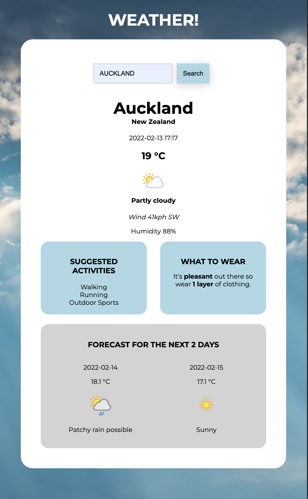

# Weather App

## Getting Started

### API Key required

If you are using this repo you will need to add a .env file with WEATHER_API_KEY="<insert-key-here>"

### From the command line

```
npm install # to install dependencies
npm run dev # to start the dev server
```

You can find the server running on [http://localhost:3000](http://localhost:3000).



## Details

This Weather App is built from the [https://www.weatherapi.com/](Weather API)
